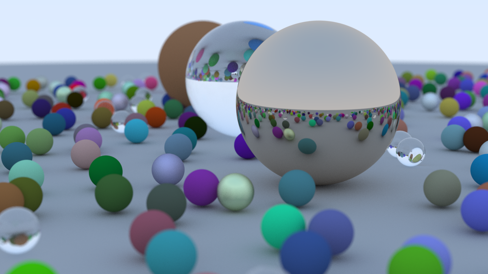

# tray-racer
A simple ray tracer. Based on https://raytracing.github.io/books/RayTracingInOneWeekend.html

# Missing Features
Lines remaining output: Pixels are calculated in parallel rather than line by line. Due to that there is no output of the number of lines remaining.

# Additional Features
Parallelism: Individuals are calculated in parallel using Rayon.

# Installation
cargo run --release > spheres.ppm

# Examples

